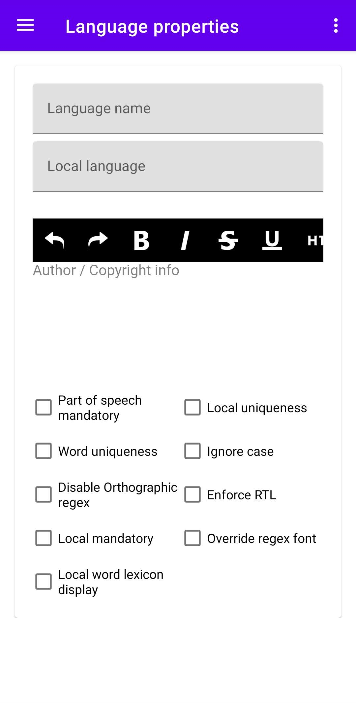
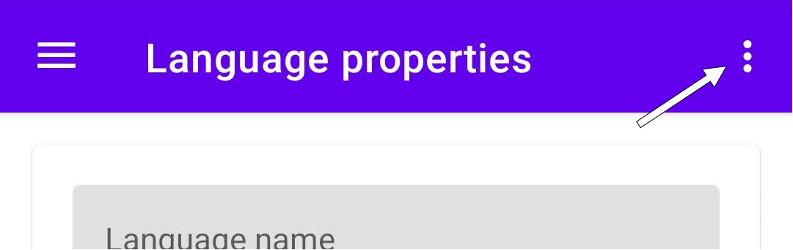
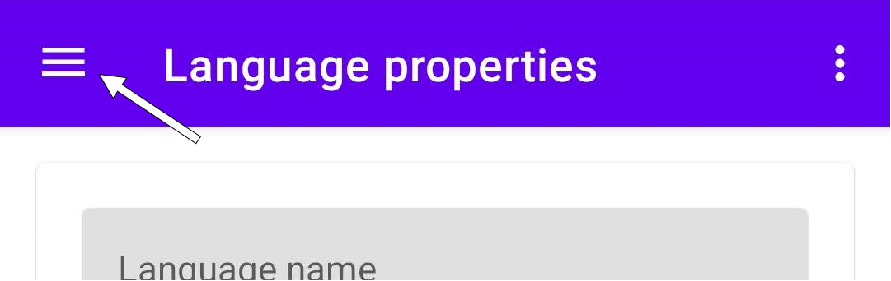

# Starting to use PolyGlot in Android  

PolyGlot for android welcomes you directly in the screen to start configuring your new conlang.  
This screen contains [language properties](properties.md).  

  
	  

  

## PolyGlot files

In the top right corner of the screen you'll find a context menu (3 dots) where you'll find options to manage the files of your conlangs.  

  
	  

  

  
	
Warning
  
	
Be sure to save your file before creating a new file or opening an existing one.
  

  

#### New file  

PolyGlot will clean itself up so you can start from scratch a new conlang, like opening the app for the first time.  

### Open file  

If you already have a PolyGlot file containing your conlang, select this option to browser for it.  

### Save file  

When you have made some progress select this option to store your file and be able to open it in the future either with this app or with the desktop one.  
The next time you open PolyGlot the conlang that was last saved will be opened by default.  

## Using PolyGlot  

In the top left corner of the screen you'll find the main menu of PolyGloy where you can access each of its sections that are described in the left menu of this documentation.  

  
	  

  